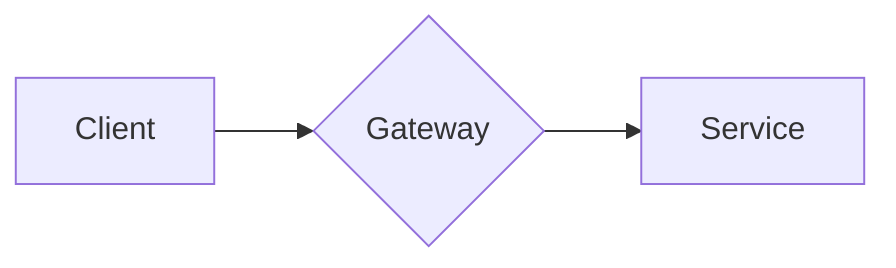

# Bold for Marp

A [Marp](https://marp.app) theme based on the [Bold Design System](https://bold.bridge.ufsc.tech/) by Laboratório Bridge / UFSC.

## Preview

Run `npm run example` to generate `examples/deck.html`, `examples/deck.pdf`, and `examples/deck.pptx` from the included demo deck (12 slides: typography, code, split layout, status colors, Mermaid diagrams in light and dark).

## Quick start

1. Clone or download the repo.
2. Create a new markdown file:

```markdown
---
marp: true
theme: bold
paginate: true
---

<!-- _class: lead -->

# My **presentation**

---

## Slide two

- Point one
- Point two
```

3. Run Marp pointing at the theme file:

```bash
marp --theme themes/bold.css deck.md -o deck.html
```

For the dark theme:

```bash
marp --theme themes/bold-dark.css deck.md -o deck.html
```

That's it. No build step, no dependencies to install.

## VS Code

Install the [Marp for VS Code](https://marketplace.visualstudio.com/items?itemName=marp-team.marp-vscode) extension, then add to `.vscode/settings.json`:

```json
{
  "markdown.marp.themes": [
    "./themes/bold.css",
    "./themes/bold-dark.css"
  ]
}
```

Then use either theme name in your front matter:

```yaml
---
marp: true
theme: bold
---
```

```yaml
---
marp: true
theme: bold-dark
---
```

## Per-slide variants

Apply with `<!-- _class: NAME -->` on a single slide, or `class:` in front matter for the whole deck.

| Class            | Effect                                           |
| ---------------- | ------------------------------------------------ |
| `lead`           | Title slide, large light-weight h1 with left accent rule |
| `split`          | Two-column grid                                  |
| `dark` / `invert`| Flip to Bold dark surface palette                |
| `light`          | Force light tokens inside a `bold-dark` deck     |

```markdown
<!-- _class: lead -->
# Bold **for Marp**

---

<!-- _class: dark split -->
## Dark side-by-side
```

## Mermaid diagrams

The package ships a custom Marp engine that renders ` ```mermaid ` fences using the Bold token palette. Light and dark themes apply automatically per slide.

1. Use `.marprc.js` (included) or point your CLI at the engine:

```bash
marp --engine ./engine/index.js --html deck.md -o deck.html
```

2. Write mermaid blocks as normal:

````markdown

````

3. Add `<!-- _class: dark -->` and the diagram palette flips automatically.

## Customizing colors

Every color is a CSS custom property. Override with the `style:` directive:

```yaml
---
marp: true
theme: bold
style: |
  section {
    --bold-accent: #AB00E7;
    --bold-bg: #F0F0F5;
  }
---
```

### Tokens

| Token                     | Purpose                              |
| ------------------------- | ------------------------------------ |
| `--bold-bg`               | Slide background                     |
| `--bold-layer`            | Code block / table header surface    |
| `--bold-divider`          | Borders and dividers                 |
| `--bold-text`             | Primary text                         |
| `--bold-text-secondary`   | Secondary text, captions             |
| `--bold-text-disabled`    | Page numbers, header, footer         |
| `--bold-accent`           | Primary brand color (Bold blue)      |
| `--bold-accent-light`     | Lighter accent shade                 |
| `--bold-accent-dark`      | Darker accent shade                  |
| `--bold-error`            | Danger / error color                 |
| `--bold-success`          | Success color                        |
| `--bold-warning`          | Alert / warning color                |
| `--bold-info`             | Info color                           |
| `--bold-highlight`        | Mark / highlight background          |
| `--bold-font-sans`        | Sans-serif font stack                |
| `--bold-font-mono`        | Monospace font stack                 |
| `--bold-pad`              | Slide padding (default `56px`)       |
| `--bold-rule`             | Accent rule thickness                |

## Color reference

Pulled from `bold-ui`:

- **light**: bg `#FFFFFF`, text `#24252E`, accent `#0069D0` (blue c40), surface `#F0F0F5`
- **dark**: bg `#24252E`, text `#FFFFFF`, accent `#84AAFF` (blue c40 inverted), surface `#3A3A47`

## What's in the box

- IBM Plex Sans and Mono (loaded from Google Fonts)
- Bold color tokens for light and dark themes
- Light default (`bold`) and dark default (`bold-dark`)
- Heading scale tuned for 16:9 1280x720 slides
- Code blocks with a Bold-flavored syntax token map
- Tables, blockquotes, lists, header, footer, pagination
- Mermaid diagram theming with per-slide dark/light detection

## Feature support

| Feature                                  | Status  | Notes                                               |
| ---------------------------------------- | :-----: | --------------------------------------------------- |
| Headings, paragraphs, nested lists       |   Yes   |                                                     |
| Bold, italic, links                      |   Yes   |                                                     |
| Tables                                   |   Yes   |                                                     |
| Inline `code` and fenced blocks          |   Yes   | Bold syntax token map                               |
| Blockquotes                              |   Yes   |                                                     |
| Header, footer, pagination               |   Yes   |                                                     |
| `color:` and `backgroundColor:` directives | Yes  |                                                     |
| Class variants (`lead`, `split`, `dark`) |   Yes   |                                                     |
| Marp auto-scaling                        |   Yes   |                                                     |
| Background images (`![bg left/right/fit/cover]`) | Yes | Marpit engine                              |
| Image filters (`blur`, `brightness`)     |   Yes   | Marpit engine                                       |
| KaTeX math (`math: katex`)               |   Yes   |                                                     |
| `<mark>` and `==highlight==`             |   Yes   |                                                     |
| Mermaid diagrams                         |   Yes   | Requires the bundled engine. Per-slide dark/light automatic. |
| Embedded video / iframes                 | Partial | Requires `--html`                                   |

## Files

```
themes/
  bold.css          # main theme, light default
  bold-dark.css     # dark default variant (self-contained)
engine/
  index.js          # custom Marp engine: Mermaid fence renderer + per-slide theming
mermaid/
  index.js          # Bold token palette for Mermaid themeVariables
src/
  build.js          # generates themes/ from bold-ui tokens
examples/
  deck.md           # demo deck source
  deck.pptx         # rendered PowerPoint (run `npm run example` to regenerate)
```

## Disclaimer

This is a personal project and is not affiliated with Laboratório Bridge, UFSC, or the Bold Design System team. For the official design system, see [bold.bridge.ufsc.tech](https://bold.bridge.ufsc.tech/).

The token values are taken from the public `bold-ui` npm package and will drift from upstream over time. Run `npm run build` after upgrading `bold-ui` to regenerate the themes.

## License

MIT.
