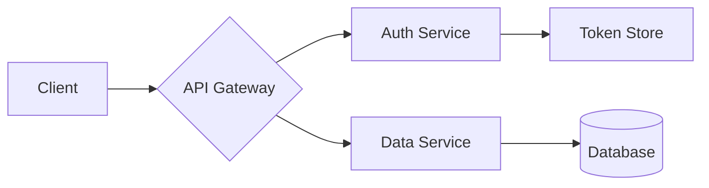
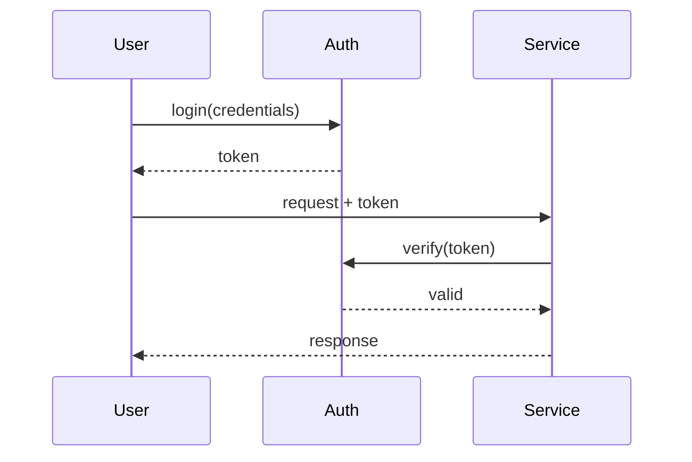

<!-- _class: lead -->
<!-- _footer: '' -->
<!-- _paginate: false -->

# Bold **for Marp**

## A Marp theme based on the Bold Design System

---

###### Section 01

# What's in the box

- Bold color tokens (light and dark)
- IBM Plex Sans and Mono
- Light and dark variants with per-slide override
- `split` two-column layout
- CSS variable overrides for any token

---

## Typography

Headings use IBM Plex Sans Light (300) at large sizes and Bold (700) at body scales. Inline `code` and code blocks use IBM Plex Mono.

> Good design is invisible.
> Julie Zhuo

---

<!-- _class: split -->

## Two columns

Use `<!-- _class: split -->` for a side-by-side layout. Headings span both columns automatically.

- Bold spacing scale
- 56px slide padding
- 4px top accent rule

```python
def bold(theme="light"):
    tokens = load(theme)
    return apply(tokens)

print(bold("dark"))
```

---

<!-- _class: dark -->

## Dark mode

Set `<!-- _class: dark -->` on a slide for the Bold dark palette, or use the `bold-dark` theme for a dark deck by default.

```ts
type Theme = 'light' | 'dark';

const tokens: Record<Theme, TokenSet> = load();
```

---

## Status colors

Bold ships semantic status tokens for all four states:

| State   | Light                      | Dark                       |
| ------- | -------------------------- | -------------------------- |
| Danger  | `#D01E29` on `#FEECED`     | `#FF888B` on `#790C14`     |
| Success | `#217B00` on `#E1F6DF`     | `#54C241` on `#0E4700`     |
| Alert   | `#AD5000` on `#FFECE8`     | `#FF8C54` on `#642B00`     |
| Info    | `#0069D0` on `#ECF0FF`     | `#84AAFF` on `#003A79`     |

---

## Customizing

Override Bold tokens via the `style:` directive:

```yaml
---
marp: true
theme: bold
style: |
  section {
    --bold-accent: #AB00E7;
    --bold-bg: #F0F0F5;
  }
---
```

---

## Nested lists and math

1. Bold ships two themes
   - `light` uses the white surface palette
   - `dark` uses the dark gray surface palette
2. Each theme is a set of design tokens
3. Inline math: $E = mc^2$

$$
\int_{-\infty}^{\infty} e^{-x^2} \, dx = \sqrt{\pi}
$$

---

## Mermaid diagrams

Architecture and flow diagrams use Bold tokens automatically. Add `<!-- _class: dark -->` and the diagram palette flips to dark tokens.



---

<!-- _class: dark -->

## Mermaid on dark



---

###### Image embedding

## Three personas

  

Inline images sized with `![w:220]`. Adam, Antony, Clista.

- ``, explicit width
- ``, natural size
- Wrap in `<figure>` for caption and border

---

<!-- _class: lead -->
<!-- _paginate: false -->

# Thanks
